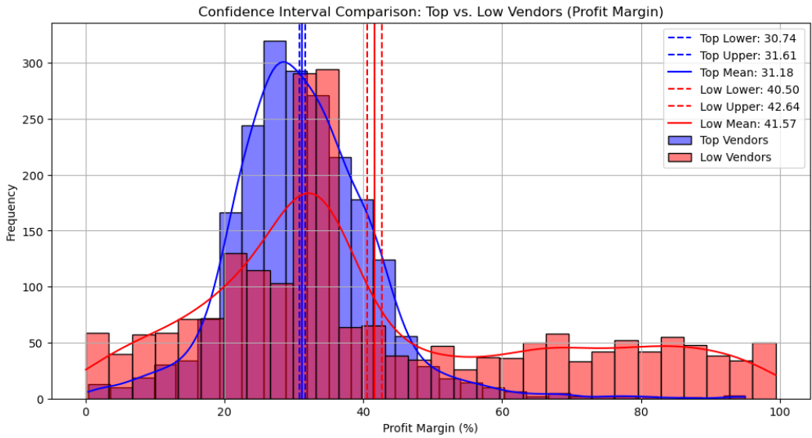

# 📦 Vendor Performance Analysis

## 🎯 Project Aim  
To analyze vendor and brand performance using statistical analysis and visual dashboards, identifying trends in sales, profit margins, inventory turnover, and vendor contribution to enable data-driven business decisions.

---

⚠️ The original database (~2GB) is excluded from the repository due to size constraints. You can contact me or use a sample dataset to replicate the analysis.

---

## ❓ Key Questions & Visualizations  

1. Which vendors contribute the most to overall purchases?
2. Are high-margin vendors underperforming in sales?
3. How does purchase volume relate to unit cost (bulk discount strategy)?
4. What is the valuation of unsold inventory across vendors?
5. Which vendors show poor stock turnover?
6. Are the profit margins of top and low-performing vendors significantly different?

---

## 🛠️ What We Did  

- **Data Preprocessing:**
  - Merged multiple sales, purchase, and inventory tables into one summary.
  - Cleaned nulls, removed outliers, and filtered irrelevant records.
  - Created new metrics like:  
    - `GrossProfit`, `ProfitMargin`, `StockTurnover`, `UnsoldCapital`, `PurchaseContribution`.

- **Statistical Analysis (Python):**
  - Calculated confidence intervals for profit margins.
  - Performed hypothesis testing using two-sample t-tests.

---

## 📊 Visualizations & Insights  

### 📈 Confidence Interval Comparison for Profit Margins

  Compares the 95% confidence intervals of profit margins for top and low-performing vendors.  
  Top vendors show higher, tighter profit margins, indicating consistent and strong performance. Low-performing vendors have wider intervals and lower margins, suggesting inconsistency or inefficiency.

---

### 🏆 Top 10 Vendors by Purchase Contribution – Bar Chart  

  Visualizes how the top 10 vendors contribute to total purchases.  
  A few vendors dominate procurement, emphasizing the importance of strategic negotiations with them.

---

### 🍩 Top 10 Vendors by Purchase Contribution – Donut Chart  

  Reinforces the 80/20 principle — most of the purchase value comes from a small number of vendors.  
  This donut view helps in presenting cumulative contribution more compactly.

---

### 🧮 Top Vendors by Sales – Brand Comparison  

  Displays the total sales by brand for each top vendor.  
  Highlights brand-wise dominance and helps identify which vendor-brand combinations perform best — useful for partnership strategies and promotion planning.

---

## 📌 Key Insights  

- High-margin but low-sales vendors are ideal candidates for targeted promotions.
- A few vendors dominate procurement costs — optimizing these relationships can yield high ROI.
- Poor stock turnover or high unsold capital signals inefficiencies — recommend clearance or inventory rotation.
- Significant statistical difference in profit margins validates focusing efforts on high-performing vendors.

---

## 🧰 Technologies Used  

- **Python:** pandas, seaborn, matplotlib, sqlite3  
- **Jupyter Notebook:** for statistical testing and EDA  
- **Logging:** for traceable and debuggable ingestion scripts

---

## 🚀 Future Enhancements  

- Incorporate delivery time and vendor reliability metrics  
- Add automated alerts for stock anomalies or margin drops  
- Forecast unsold inventory using time-series modeling  
- Integrate with real-time procurement dashboard

---
